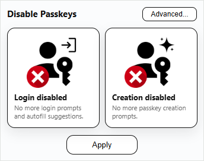
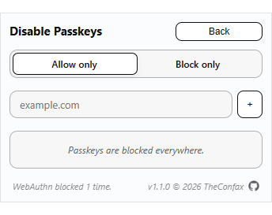

# Disable Passkeys
A small Chrome extension to block passkey (WebAuthn) prompts and their autofill.

  

## Why this?
As of 2026, this is the **only way** to truly and completely disable passkey prompts and passkey autofill in Chrome.

This project exists to give **control back to the user**.

Passkeys are increasingly pushed by browsers and websites, but they can:  
- Trigger unwanted system dialogs
- Create conflicts with other password managers
- Be undesirable in shared or managed environments
- Break automation or specific password-based workflows

## What does it do?
This extension **rejects WebAuthn requests** and can be configured to block passkey login, creation, or both. Passkey entries in autofill will be blocked as well.

</img>

### Other features:
- Whitelist/blacklist domain filters
- Reactive UI showing interventions and status
- 5 supported languages (🇬🇧 🇫🇷 🇩🇪 🇮🇹 🇪🇸)
- Adaptive light/dark mode UI
- Accessible UI with full keyboard navigation
- Settings synced cross-device

## Installation
**Install from the Chrome Web Store**  

  

## Usage
### Main page
In the main page of the popup you can choose to selectively block/allow:
- ✅❌ Passkey Login/Autofill (Blocking WebAuthn `get()`)
- ✅❌ Passkey Creation (Blocking WebAuthn `create()`)

This page will also inform you if you have some filters active or if the extension is set to off.

### Advanced page
In the advanced page of the popup you can:
- 🏳️🏴 Choose to operate in whitelist/blacklist mode
- ➕➖ Add and remove domains from your list

Domains can be inserted in pretty much every format you like and will be parsed to something like `example.com`. You can also block IPv4s, IPv6s, and `localhost`.

### Action icon
The action icon will display if the extension is on with the presence/absence of a 🚫.

The action icon will flash a green `!` when WebAuthn is being blocked, interventions are counted in the advanced page.

The action icon will display a permanent yellow `!` when the configuration is set to blacklist no domain and some block toggle is armed, in order to warn the user of the misconfiguration.

