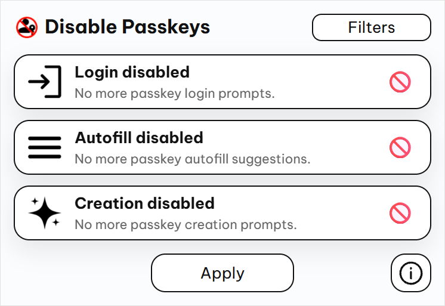
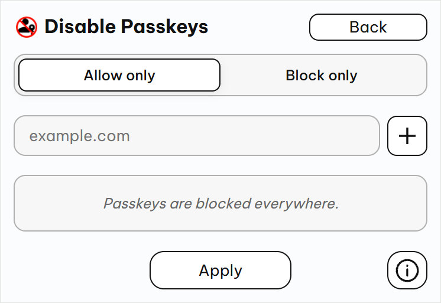

# Disable Passkeys
A small Chrome and Firefox extension to block passkey (WebAuthn) prompts and their autofill.

  

  

## Why this?
As of 2026, this is the **only way** to truly and completely disable passkey prompts and passkey autofill in Chrome, and to have granular control over which ones you still see, by type and by site.

This project exists to give **control back to the user**.

Passkeys are increasingly pushed by browsers and websites, but they can:  
- Trigger unwanted system dialogs
- Create conflicts with password managers
- Be undesirable in shared or managed environments
- Break automation or specific password-based workflows

## What does it do?
This extension **blocks WebAuthn requests** and can be configured to block passkey login prompts, passkey creation prompts, and passkey autofill suggestions, independently.

### Other features:
- Whitelist/blacklist domain filters
- Reactive UI showing hints and status
- 5 supported languages (🇬🇧 🇫🇷 🇩🇪 🇮🇹 🇪🇸)
- Adaptive light/dark mode UI
- Accessible UI with full keyboard navigation
- Settings synced cross-device

## Installation
**Install from the Chrome Web Store or from Firefox Add-ons**  

  

  

## Usage
### Main page
In the main page of the popup you can choose to selectively block/allow:
- ✅🚫 Passkey Login (WebAuthn `get()`, modal)
- ✅🚫 Passkey Autofill (WebAuthn `get()`, conditional mediation)
- ✅🚫 Passkey Creation (WebAuthn `create()`)

This page will also inform you if you have some filters active or if the extension is set to off.

### Advanced page
In the advanced page of the popup you can:
- 🏳️🏴 Choose to operate in whitelist/blacklist mode
- ➕➖ Add and remove domains from your list

Domains can be inserted in pretty much every format you like and will be parsed into something like `example.com`. You can also block IPv4s, IPv6s, and `localhost`.

### Action icon
The action icon shows a 🚫 when the extension is set to block something, and drops it when it isn't.

The action icon will flash a green `!` when WebAuthn is being blocked, interventions are counted in the "About" page.

The action icon will display a permanent yellow `!` when the configuration is set to blacklist no domain and some block toggle is armed, in order to warn the user of the misconfiguration.